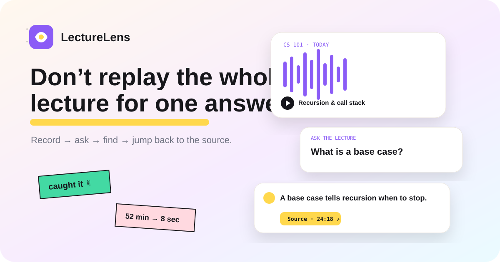

# LectureLens

<p align="center">
  
</p>

<p align="center">
  <a href="https://github.com/Abdelrahmany-Radwan/LectureLens/actions/workflows/ci.yml"></a>
  <a href="https://github.com/Abdelrahmany-Radwan/LectureLens/actions/workflows/evaluation.yml"></a>
  <a href="https://github.com/Abdelrahmany-Radwan/LectureLens/actions/workflows/pages.yml"></a>
</p>

> **Hear it. Find it. Study it.**

LectureLens is a local-first lecture companion that turns timestamped class transcripts into searchable evidence. It is designed around one product principle: **answers should point back to where the instructor actually said it.**

**Product direction:** record/import lecture audio → build a timestamp-aware transcript index → retrieve relevant source passages with semantic + lexical ranking → jump back to the exact source time.

## Why it exists

Lecture transcription, summaries, and searchable notes are useful, but many products put the most valuable features behind recurring subscriptions. LectureLens explores how much of that workflow can be built with browser APIs and compact local ML while keeping the source evidence visible.

## Current milestone

- in-browser audio recording with `MediaRecorder`
- audio import and playback
- local browser speech-to-text with `Xenova/whisper-tiny.en`
- timestamped Whisper transcript output
- live waveform feedback
- timestamp-aware transcript parsing
- MiniLM sentence embeddings in the browser with Transformers.js
- semantic + lexical evidence ranking
- clickable source timestamps
- structured lecture outline
- quick-review study cards
- persistent multi-lecture library with IndexedDB
- lecture audio + transcript reopening across reloads
- ML inference isolated in a Web Worker so Whisper/MiniLM do not own the UI thread
- lightweight transcript chapter grouping
- lexical fallback if the semantic model is unavailable
- Playwright end-to-end product tests
- responsive, reduced-motion-aware UI

Browser speech-to-text is now implemented with **Whisper Tiny English running locally through Transformers.js**. Recorded or imported audio is decoded in-browser, transcribed into timestamped segments, and then indexed for semantic search.

## System

```text
microphone / audio file
        │
        ▼
browser recording + playback
        │
        ▼
timestamped transcript
        │
        ▼
transcript segmentation
        │
        ├──────────────┐
        ▼              ▼
MiniLM embeddings   lexical overlap
        │              │
        └──────┬───────┘
               ▼
       hybrid evidence ranker
               │
               ▼
 question → source passage → timestamp
```

The public interface runs `Xenova/all-MiniLM-L6-v2` with Transformers.js. Search remains usable with lexical scoring if model loading fails.

## Evaluation

LectureLens includes a reproducible retrieval benchmark under `evaluation/` designed to test whether a question retrieves the correct lecture passage, including hard negatives that discuss related concepts without actually answering the question.

The current benchmark contains **40 labeled query/passage pairs across 10 complete query groups**, with one relevant passage and three hard negatives per query. Six query groups are used for development and four are held out for final testing.

| Held-out metric | Hybrid retrieval |
| --- | ---: |
| Precision | **0.667** |
| Recall | **1.000** |
| F1 | **0.800** |
| Accuracy | **0.875** |
| Recall@1 | **1.000** |
| Recall@3 | **1.000** |
| MRR | **1.000** |

Median semantic scoring latency on the GitHub Actions CPU runner was **3.769 ms per query/passage pair**.

The ranking results mean the correct source passage ranked first for all four held-out query groups in this small regression benchmark. These numbers are deliberately scoped to the current curated dataset; they are not claims about population-level lecture-search quality.

## Speech recognition evaluation

LectureLens also includes a separate **real-audio ASR regression benchmark** for Whisper Tiny English.

| ASR metric | Result |
| --- | ---: |
| Normalized Word Error Rate | **8.0%** |
| Labeled clips | **8** |
| Total audio | **86.345 s** |
| Total inference time | **11.398 s** |
| Real-time factor | **0.132** |

The benchmark uses labeled **LibriSpeech read-English audio**, not classroom lecture recordings. It measures the corresponding Whisper Tiny English model in the Python evaluation workflow; it does **not** claim identical browser runtime performance for Transformers.js. Lower WER is better, and an RTF below 1.0 means the benchmark processed audio faster than real time on the GitHub Actions CPU runner.

## Classroom speech evaluation

To test the model in the actual product domain, LectureLens also runs a separate classroom-speech regression benchmark against **CoTACS — the Corpus of Teaching Assistant Classroom Speech**.

| Classroom ASR metric | Result |
| --- | ---: |
| Normalized Word Error Rate | **30.3%** |
| Speaker | **ATA1** |
| Evaluated segment | **120.0 s** |
| Reference words | **165** |
| Hypothesis words | **138** |
| Inference time | **12.151 s** |
| Real-time factor | **0.1013** |

This result uses the first 120 seconds of real university classroom speech from CoTACS with its aligned `TA - words` TextGrid tier. It is intentionally reported separately from the cleaner LibriSpeech benchmark. The 30.3% WER shows that classroom speech is materially harder for Whisper Tiny English than read speech, which is an important product limitation rather than something LectureLens hides.

This is a **single-speaker regression sample**, not a population-level classroom accuracy claim. CoTACS is licensed under **CC BY-NC 4.0** and is downloaded only during the evaluation workflow rather than redistributed in this repository. Source: https://www.spokencorpus.com/

## Engineering decisions

- **Source evidence over generated certainty.** Results point to transcript text and timestamps.
- **Local-first architecture.** The first release does not require a LectureLens backend for indexing or search.
- **Separable pipeline.** Capture, transcription, segmentation, retrieval, and study views are independent layers.
- **Graceful degradation.** Lexical search remains available when the embedding model cannot load.
- **Measured retrieval.** Evaluation is separate from UI validation and deployment.
- **Privacy-aware defaults.** Browser recording and transcript persistence avoid unnecessary centralized storage.

## Roadmap

1. smarter topic-aware chapter segmentation
2. exportable study packs
3. WebGPU performance experiments
4. larger multi-speaker classroom ASR benchmark
5. student usability study

## License

MIT
